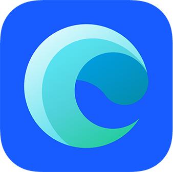

<p align="center">
  
</p>
<h1 align="center"><strong>Code</strong>Canarias</h1>
<p>
  <a href="/LICENSE"></a>
  <a href="https://twitter.com/patricia_mayo">
    
  </a>
</p>

[🇬🇧 View the README in English](https://github.com/patriciamayo/code-canarias/blob/master/README-en.md)

CodeCanarias es el sitio para encontrar personas excepcionales a las que seguir, buscar un mentor o descubrir canarios con talento a las que contratar. Queremos tener un lugar para mostrar el potencial de los canarios en tecnología y aumentar el empleo en las islas.

## 💼 Cómo hacerte Patrocinador

Si eres una empresa o institución y te gustaría aparecer en nuestra lista de Patrocinadores mándanos un email. No solo serás incluido en la lista, sino que también aparecerás en la página principal de manera aleatoria.

## 🏆 Cómo añadir tu perfil

¡Es muy fácil! Si eres de las Islas Canarias y te dedicas al campo de la informática y el desarrollo, puedes añadir tu perfil para que aparezca en nuestra lista de "coders".

### La manera fácil
1. [Haz click aquí](https://github.com/patriciamayo/code-canarias/new/master/content/coders)
2. Nombra el documento con el formato  `nombre-apellido.md`
3. Copia y pega la plantilla
  
```yaml
---
name: Patricia Mayo Tejedor
# Opciones | Options: Mujer / Hombre / Otro. Solo se pide para poder mostrar de manera balanceada los perfiles al inicio de la página principal | We only use this to have balanced profiles at the landing page.
gender: Mujer
# Tu bio con un máximo de 140 characteres | your bio with max 140 characters.
bio: Desarrolladora de apps iOS 🍎 y Android 🤖
# Link a github es obligatorio | Mandatory link to github
github: https://github.com/patriciamayo/
linkedin: https://www.linkedin.com/in/patriciamayotejedor/
website: patriciamayo.com
email: fake-email@gmail.com
twitter: https://twitter.com/patricia_mayo
# Opciones | Options: El Hierro / La Palma / La Gomera / Tenerife / Gran Canaria / Fuerteventura / Lanzarote / La Graciosa
island: Gran Canaria
image: https://pbs.twimg.com/profile_images/827225971925405699/dKnt5AJT_400x400.jpg
# Añade tus 6 mejores habilidades | Add your top 6 skills
skills:
    - iOS
    - Android
    - Swift
    - Mobile
    - Vue
    - IoT
languages:
    - name: Inglés
      icon: 🇬🇧
    - name: Francés
      icon: 🇫🇷
---

Descripción larga | Long description here
Puedes poner tus estudios, tu experiencia, tus hobbies en formato Markdown. | You can add your studies, your experience, your hobbies.. in Markdown format
```

1. Personaliza la plantilla con tus propios datos
2. Pon un nombre a tu commit y dale click al botón 'Commit new file'

### La manera `coder`
1. Haz un Fork del repositorio
2. Ve a `/content/coders`
3. Crea un documento con el formato `nombre-apellido.md`
4. Copia y pega la plantilla de arriba y sustituye el contenido con tus datos
5. Commit y envía tu PR

## ⚙️ Como  ejecutar la web

```bash
# install dependencies
$ npm install

# serve with hot reload at localhost:3000
$ npm run dev

# build for production and launch server
$ npm run build
$ npm run start

# generate static project
$ npm run generate
```

📚 Más documentación
* [Nuxt.js](https://nuxtjs.org)

## 🤝 Contribuir
¡Las contribuciones, los fallos y las sugerencias son bienvenidas!

## ⭐️ Muestra tu apoyo
Dale una ⭐️ a este repo si el proyecto te ha sido útil

## 📝 Licencia
Copyright © 2020 Patricia Mayo Tejedor
This project is [MIT](/LICENSE) licensed.